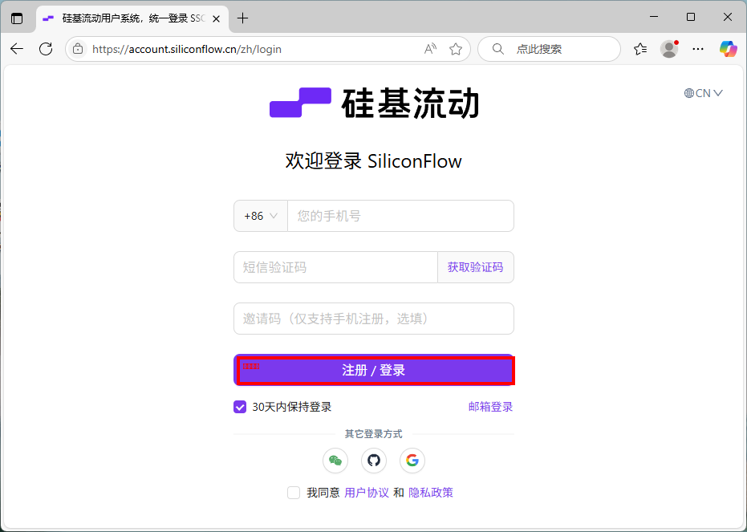
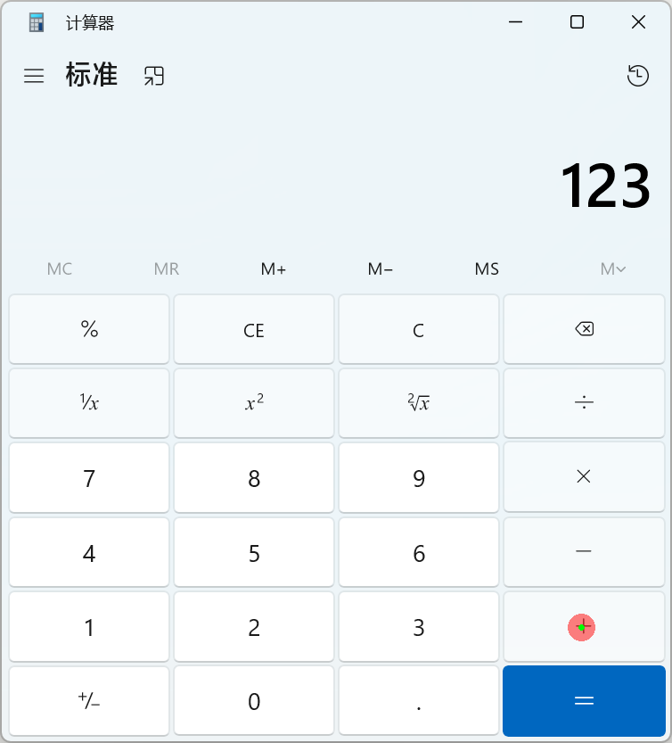

# 桌面视觉智能体：基于 Qwen2.5-VL-3B 的探索与实现

本项目旨在探索如何利用轻量级视觉语言模型（VLM）**Qwen2.5-VL-3B** 完成桌面自动化任务。通过实现图像理解、UI 元素定位，并最终构建一个模拟的自动化工作流，我们系统性地评估了该模型在桌面智能体场景下的核心能力与挑战。

整个项目在配备 **NVIDIA RTX 3060 Laptop (6GB VRAM)** 的个人电脑上完成，并选用 `unsloth/Qwen2.5-VL-3B-Instruct-unsloth-bnb-4bit` 这一经过 4-bit 量化的高度优化模型，以确保在有限的硬件资源下流畅运行。

---

## 🚀 项目亮点

- **高效部署**：采用 4-bit 量化模型和 Flash Attention 2，在消费级显卡上成功部署和运行 3B 规模的 VLM。
- **模块化设计**：将模型加载、推理、定位和可视化等功能封装为可复用的工具函数，代码结构清晰。
- **三阶段递进**：
    1.  **基础能力验证**：系统测试了模型的图像描述（Captioning）和视觉问答（VQA）能力。
    2.  **视觉定位**：实现了从自然语言指令到 UI 元素边界框坐标的精准转换，并进行了可视化。
    3.  **工作流模拟**：设计并实现了一个多步骤的计算器任务，模拟了智能体 "观察 -> 思考 -> 行动" 的完整闭环。
- **详尽的可视化**：对模型的每一步定位和行动决策都生成了可视化结果，便于分析和调试。

---

## 📂 项目结构

```
/qwenvl
├── data/                  # 存放测试用的各类桌面截图
│   ├── login_page.png
│   ├── file_explorer.png
│   └── calc_*.png         # 计算器任务的截图序列
├── output/                # 存放所有实验的输出结果
│   ├── grounding_*.png    # 阶段二的定位结果图
│   └── calculator_task/   # 阶段三的自动化流程可视化结果
├── scripts/               # 核心执行脚本
│   ├── 01_test_environment.py
│   ├── 02_stage1_basics.py
│   ├── 03_stage2_grounding.py
│   ├── 04_stage3_workflow.py
│   └── utils/             # 工具函数模块
│       ├── model_loader.py
│       └── grounding_utils.py
└── README.md              # 本文档
```

---

## 🔧 环境搭建

1.  **硬件要求**:
    - 推荐使用配备 NVIDIA GPU 的电脑，显存 >= 6GB。

2.  **创建虚拟环境**:
    ```bash
    conda create -n qwenvl python=3.12
    conda activate qwenvl
    ```

3.  **安装核心依赖**:
    项目所需的所有Python包都已记录在 `requirements.txt` 文件中。推荐使用以下命令一键安装所有依赖。

    ```bash
    pip install -r requirements.txt
    ```

    **[重要提示] 关于 PyTorch**:
    - `requirements.txt` 文件通常会包含一个特定版本的 PyTorch（例如，为特定CUDA版本编译的）。如果上述命令因 PyTorch 安装失败，或者你希望为你的系统（如不同的CUDA版本或仅CPU）安装最合适的版本，**强烈建议**采用以下更稳健的方法：
    
      **步骤 A：手动安装 PyTorch**
      - 访问 [PyTorch官网](https://pytorch.org/get-started/locally/)。
      - 选择适合你的配置（例如：Stable, Windows/Linux, Pip, Python, CUDA 12.1）。
      - 复制并运行官网提供的命令，例如：
        ```bash
        # 这是一个示例，请使用官网生成的命令
        pip install torch torchvision torchaudio --index-url https://download.pytorch.org/whl/cu121
        ```

      **步骤 B：安装其余依赖**
      - 在 `requirements.txt` 文件中**注释掉或删除**包含 `torch`、`torchvision`、`torchaudio` 的那几行。
      - 然后运行安装命令：
        ```bash
        pip install -r requirements.txt
        ```

4.  **模型下载**:
    无需手动下载。首次运行任意脚本时，`utils/model_loader.py` 中的代码会自动通过 `modelscope` 从云端下载并缓存模型文件到本地。

---

## ⚙️ 如何运行

请按照数字顺序执行以下脚本，体验项目的三个阶段。

### 1. 阶段一：基础能力测试

此脚本用于测试模型对桌面截图的基础理解能力，包括图像描述和视觉问答。

```bash
Python scripts/02_stage1_basics.py
```
- **功能**：加载 `data/login_page.png`，并向模型提出描述和问答请求。
- **自定义**：你可以修改 `02_stage1_basics.py` 文件底部的 `test_image` 变量，换成 `data/` 目录下的其他图片进行测试。
- **输出**：结果会直接打印在控制台中。

### 2. 阶段二：视觉定位 (Grounding)

此脚本演示了如何将自然语言指令（如“定位登录按钮”）转换为 UI 元素的边界框，并进行可视化。

```bash
Python scripts/03_stage2_grounding.py
```
- **功能**：针对 `data/login_page.png` 和 `data/file_explorer.png` 执行多个定位任务。
- **Prompt 设计**：脚本中精心设计了 `system_prompt` 和 `prompt_template`，引导模型以期望的 JSON 格式输出坐标。
- **输出**：定位结果图将保存在 `output/` 目录下，例如 `grounding_login_button.png`。

### 3. 阶段三：自动化工作流模拟

这是项目的核心展示。脚本模拟了一个智能体使用计算器计算 "123 + 456" 的完整流程。

```bash
Python scripts/04_stage3_workflow.py
```
- **工作原理**：
    1.  智能体按预设步骤（如“点击按钮'1'”）接收任务。
    2.  观察当前状态的截图（如 `calc_01_initial.png`）。
    3.  调用 VLM 定位目标按钮，计算出点击坐标。
    4.  生成模拟的 `CLICK` 指令。
    5.  将该次行动可视化，保存为图片。
    6.  进入下一步（通过加载下一张预置截图来模拟界面变化）。
- **输出**：每一步的决策可视化结果将保存在 `output/calculator_task/` 目录下，完整地记录了智能体的“思考”与“行动”过程。

---

## 💡 核心实现细节

### `utils/model_loader.py`
- **单例模式**: 使用全局变量 `_model` 和 `_processor` 缓存已加载的模型，避免在多任务中重复加载，极大地提高了效率和节省了显存。
- **性能优化**: 明确指定 `torch_dtype=torch.bfloat16` 并启用 `attn_implementation="flash_attention_2"`，充分利用硬件加速。

### `utils/grounding_utils.py`
- **端到端推理 (`inference`)**: 封装了从图像/文本输入到模型文本输出的全过程，并巧妙地返回了模型内部处理图像的归一化尺寸，这是后续坐标转换的关键。
- **坐标转换与鲁棒解析**: `plot_bounding_boxes` 函数不仅能将模型输出的归一化坐标（0-1000 范围）准确映射回原图尺寸，还包含了对模型可能输出的不完整或格式错误的 JSON 的容错解析逻辑。
- **行动可视化 (`draw_click_on_image`)**: 专为阶段三设计，能清晰地在原图上标记出智能体模拟点击的位置，使 Agent 的行为直观可见。

---

## 📊 示例结果

#### 阶段二：UI 元素定位



*图 1：成功定位登录页面上的“登录”按钮。指令：“定位登录按钮”。*

#### 阶段三：自动化流程中的一步



*图 2：在计算器任务的第 4 步，智能体根据指令“点击加号按钮 '+'”，成功定位并生成了点击操作。*

---

## 🔮 总结与展望

本项目成功验证了 **Qwen2.5-VL-3B** 这一轻量级模型在桌面视觉任务上的潜力。它展现了良好的 OCR 和 UI 元素定位能力，足以支持简单的多步骤任务自动化模拟。

**未来可探索的方向**：
1.  **真实环境交互**：集成 `pyautogui` 或 `robotjs` 等库，将模拟的 `CLICK` 和 `TYPE` 指令转化为真实的鼠标键盘操作。
2.  **增强的上下文理解**：引入对话历史或记忆模块，使智能体能够处理更复杂的、依赖前序步骤的任务。
3.  **动态观察与错误恢复**：实现一个真正的循环，让智能体在执行操作后能主动重新截图（观察），并根据屏幕变化判断操作是否成功，若失败则尝试纠错。
4.  **多模态工具学习**：让模型不仅能定位，还能调用外部工具，例如调用一个更专业的 OCR 工具来读取屏幕上的密集文本，并将结果反馈给模型进行决策。

---

## 📜 许可证 (License)

本项目采用 [Apache 2.0 License](LICENSE) 开源许可证。

## 🙏 致谢 (Acknowledgements)

本项目的完成离不开以下优秀团队和开源项目的支持，在此表示衷心的感谢：

-   **通义千问 (Qwen) 团队**: 感谢他们研发并开源了功能强大的 Qwen2.5-VL 系列模型。
-   **Unsloth 团队**: 感谢他们提供了极其高效的模型量化和推理优化方案，使得在消费级硬件上运行大模型成为可能。
-   **Hugging Face**: 感谢其开发的 `transformers` 库，它已成为自然语言处理和多模态研究领域不可或缺的基础设施。
-   **ModelScope**: 感谢其为国内用户提供了便捷的模型下载和托管服务。

没有这些开放和协作的社区，本项目的探索将无从谈起。